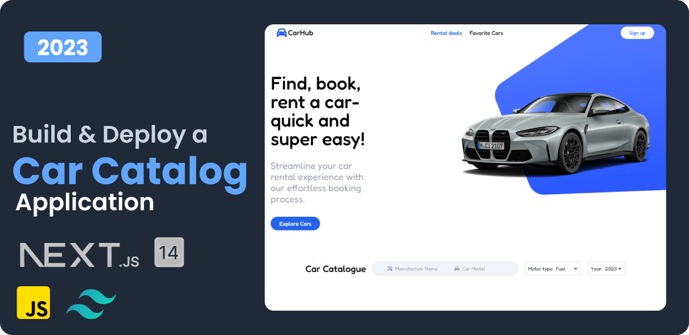

# Car Catalog Application

## Project Description

The Car Catalog Application is a web application created using Next.js. It allows users to browse the car catalog, add favorite models to the favorites list, and search for cars according to various criteria.

## Installation Instructions

To install and run this application, follow these steps:

1. Clone the repository to your local environment.
2. Install dependencies using `npm install`.
3. Run the application using `npm run dev`.

## Usage Instructions

After launching the application, you can browse the car catalog, add favorite models to the favorites list, and search for cars according to various criteria.

## License

This project is released under the MIT license. More information can be found in the LICENSE file.

## Contact Information

If you have any questions or would like to discuss this project, please email pawelsarzynski51@gmail.com.

## Acknowledgments

Thank you to everyone who contributed to the creation of this application!